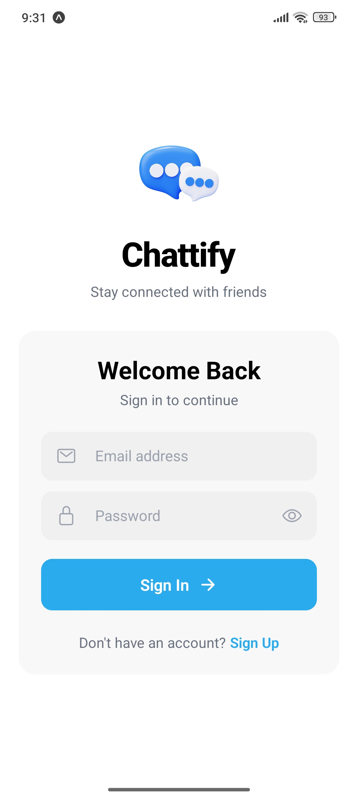
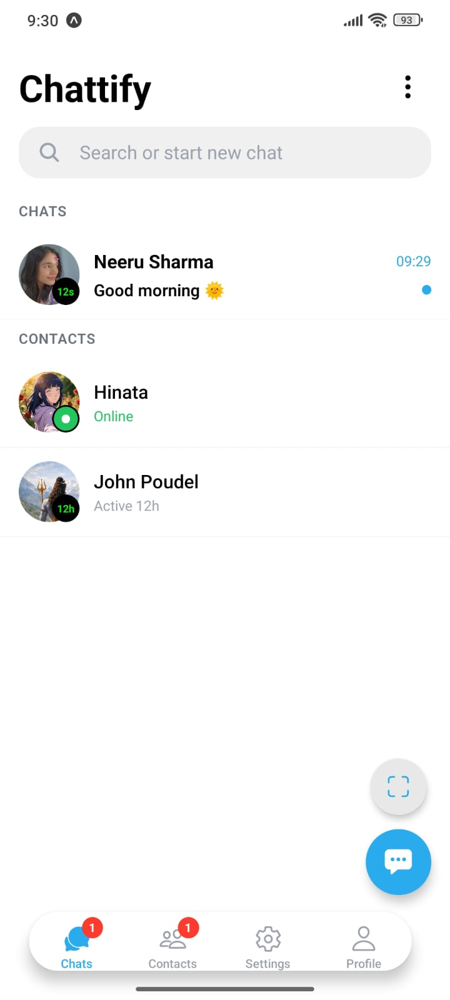
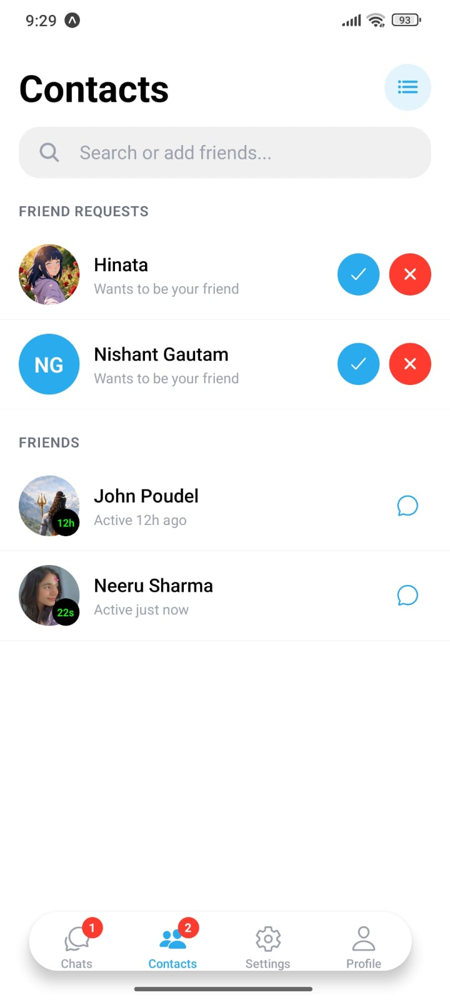
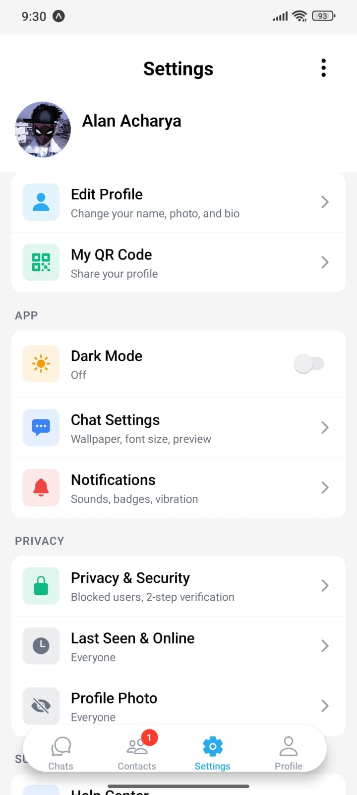

# Chattify - Real-time Chat Application

A modern messaging app built with React Native (Expo) and Firebase. Chattify brings you smooth, real-time conversations with a clean Telegram-inspired interface.

## Screens
<p float="left">
  
  
  
  
  
  
  
</p>

<p float="left">
  <b>Login Page</b>&nbsp;&nbsp;&nbsp;&nbsp;
  <b>Chats Page</b>&nbsp;&nbsp;&nbsp;&nbsp;
  <b>Contact Page</b>&nbsp;&nbsp;&nbsp;&nbsp;
  <b>Chat Room</b>&nbsp;&nbsp;&nbsp;&nbsp;
  <b>Settings Page</b>&nbsp;&nbsp;&nbsp;&nbsp;
  <b>Profile Page</b>&nbsp;&nbsp;&nbsp;&nbsp;
  <b>Qrcode Page</b>
</p>
---

## Features

### Authentication
- Email/password sign up and login
- Secure authentication with Firebase
- Persistent login sessions

### Messaging
- Real-time one-on-one chat
- Message status indicators (sent, delivered, read)
- Typing indicators
- Custom chat backgrounds (6 themes to choose from)
- Delete chat functionality

### Contacts & Friends
- Search users by name or email
- Send and receive friend requests
- Accept or decline requests
- QR code scanning for quick friend adding
- Online status indicators with last seen

### Profile
- Custom profile picture upload (via Cloudinary)
- QR code generation for profile sharing
- Edit bio and display name
- View friends count

### User Experience
- Dark/Light theme toggle
- Floating bottom tab navigation
- Smooth animations and transitions
- Safe area support for notched devices

## Setup

### Prerequisites

- Node.js 18+ installed
- npm or yarn package manager
- Firebase account
- Cloudinary account (for image uploads)

### Installation

1. Clone the repository:
```bash
git clone <repository-url>
cd chattify
```

2. Install dependencies:
```bash
npm install
```

3. Create your Firebase project:
   - Go to [Firebase Console](https://console.firebase.google.com)
   - Create a new project
   - Enable Realtime Database
   - Enable Authentication (Email/Password)
   - Copy your config values

4. Set up Cloudinary:
   - Create a free account at [Cloudinary](https://cloudinary.com)
   - Create an unsigned upload preset named `chattify_preset`
   - Copy your cloud credentials

5. Configure environment variables:
```bash
cp .env.example .env
```

Then edit `.env` with your credentials:
```env
FIREBASE_API_KEY=your_api_key
FIREBASE_AUTH_DOMAIN=your_project.firebaseapp.com
FIREBASE_DATABASE_URL=https://your_project-default-rtdb.firebaseio.com
FIREBASE_PROJECT_ID=your_project_id
FIREBASE_STORAGE_BUCKET=your_project.firebasestorage.app
FIREBASE_MESSAGING_SENDER_ID=your_sender_id
FIREBASE_APP_ID=your_app_id

CLOUDINARY_CLOUD_NAME=your_cloud_name
CLOUDINARY_API_KEY=your_api_key
CLOUDINARY_API_SECRET=your_api_secret
```

### Running the App

Start the development server:
```bash
npx expo start
```

Run on Android:
```bash
npx expo run:android
```

Run on iOS:
```bash
npx expo run:ios
```

## Project Structure

```
chattify/
├── app/                    # Expo Router screens
│   ├── (auth)/            # Authentication screens
│   ├── (tabs)/            # Tab navigation screens
│   ├── chat/              # Chat room screen
│   ├── user/              # User profile screen
│   └── scanner.tsx        # QR scanner
├── components/            # Reusable components
├── context/               # React Context providers
├── constants/             # Theme and styling constants
├── lib/                   # Firebase configuration
└── assets/               # Images and fonts
```

## Tech Stack

- **Frontend**: React Native with Expo SDK 54
- **Navigation**: Expo Router (file-based routing)
- **Backend**: Firebase Realtime Database
- **Storage**: Cloudinary for image uploads
- **Icons**: Ionicons

## Firebase Rules

Add these rules to your Realtime Database for proper access control:

```json
{
  "rules": {
    "users": {
      "$uid": {
        ".read": "$uid === auth.uid",
        ".write": "$uid === auth.uid"
      }
    },
    "messages": {
      "$convId": {
        ".read": true,
        ".write": true
      }
    }
  }
}
```

## Contributing

Contributions are welcome! Feel free to submit issues and pull requests.

## License

This project is open source and available under the MIT License.
